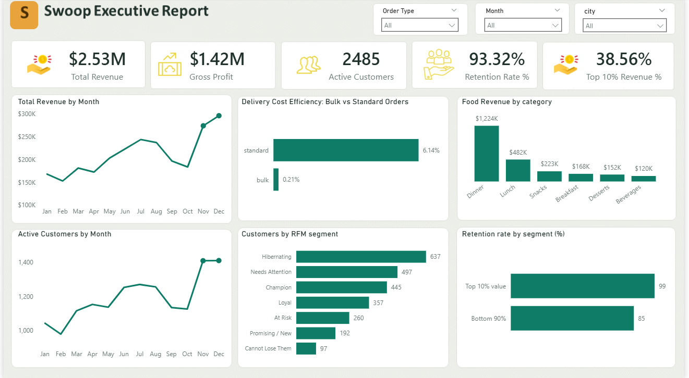

# 🚀 Swoop Food Delivery Analytics Project

## Project Overview

This project analyzes operational and customer behavior data for **Swoop**, a food delivery platform, using **PostgreSQL, SQL, Power BI, and DAX**.

The goal was to identify revenue drivers, customer retention trends, operational efficiency, and customer segmentation patterns to support strategic business decision-making.

---

## Tools Used

- PostgreSQL  
- SQL  
- Power BI  
- DAX  
- Data Visualization  
- Business Intelligence  

---

## Business Objectives Covered

✔ Analyze monthly revenue trends  
✔ Identify top-performing food categories  
✔ Compare bulk vs standard delivery efficiency  
✔ Track monthly active customer growth  
✔ Perform customer segmentation using RFM analysis  
✔ Measure retention rate across customer segments  

---

# 🌐 Interactive Dashboard (Live Power BI)

You can interact with the dashboard directly here:

👉 **[Click Here to View Live Dashboard](https://app.powerbi.com/view?r=eyJrIjoiZGQ5ZmRhNTMtOWUxZS00N2IwLTllZTItYmY0NzRhNDdjZmFmIiwidCI6ImZmMGYzZTNhLTNlNTMtNDU0Zi1iMmI1LTZjNjg3NTNiOGVlNCJ9)**

Use filters and slicers to explore the dashboard.

---

## Dashboard Preview

---

## Key Business Insights

- Total revenue generated reached **$2.53M**  
- Dinner category generated **$1.22M**, highest across all categories  
- Bulk orders proved significantly more cost-efficient (**0.2% vs 6.1%**)  
- Monthly active customers increased by **23% in Q4**  
- Champion customers were identified as the highest-value customer segment  
- Top 10% customers recorded **99% retention rate**  

---

## Project Files

### 📊 Power BI Dashboard File

Download Power BI project file:

👉 [Download PBIX File](./swoop_dashboard.pbix)

---

### 📑 Executive Business Presentation

View presentation slides:

👉 [Open Presentation](./swoop_business_presentation.pptx)

---

### 💻 SQL Analysis Queries

View SQL queries used for data extraction and analysis:

👉 [Open SQL Queries](./swoop_analysis_queries.sql)

---

## Skills Demonstrated

- SQL Querying  
- PostgreSQL Database Analysis  
- DAX Measures  
- Dashboard Development  
- Customer Segmentation (RFM Analysis)  
- Business Intelligence Reporting  
- Data Cleaning  
- Data Storytelling  
- Strategic Business Recommendations  

---

## Final Outcome

This project demonstrates my ability to execute an **end-to-end data analytics workflow**, starting from SQL data extraction and business analysis to interactive dashboard development and executive-level business insight generation.

---

### Connect With Me

LinkedIn: (www.linkedin.com/in/esmeralda-pinamang-osei-942a35111)  
